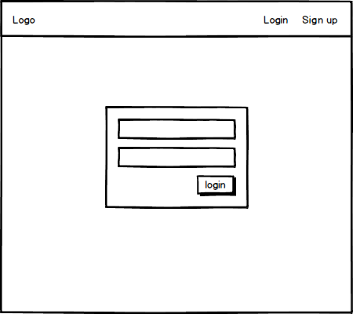
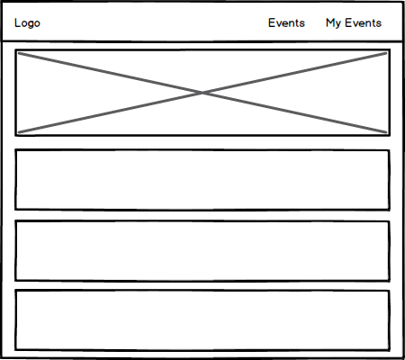

# Gathr Read Me 

# About
Gathr is a platform for tracking and inviting your groups to attend tech meetups. 

# [Link to my Trell Board](https://trello.com/b/NS1sQqPr/project-2-gathr)

# [Link to Gathr](https://letsgathr.herokuapp.com)

## Wireframes
### Sign in

### Events

### My Events

## Technologies
Ejs for rendering, node.js, express, mongoose and some ajax

## Approach
The idea was to base the data off of the user and event models. The user is the main driver if you will with the event model providing embeded data to the user.

## Basic instructions
Users can sign up for an account. After signup they may login and from there may choose to track events they are interested in. Users also have the option to invite their squad (a group they wish to attend events with) to the event with them. Because networking is way more fun not alone.

## Data Models
Three main models are used, User, Events and Invites. Events and Invites are embeded data provided to User. 

## Todos
Working on implementing new features such as a user search to add users and eventually want to convert to angular.

## Whos is the target user?
The target is those in the technology world but mainly students in cohorts like us.

## Why does this help?
As new developers its hard to walk into something you may not be comfortable with to start and having familar faces can go a long way.
